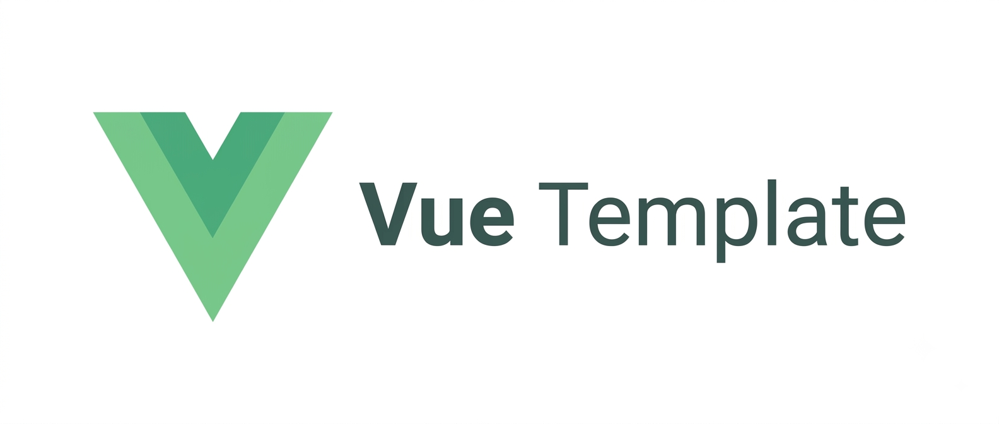

<p align="center">
  
</p>

<p align="center">
  <a href="https://vuejs.org/">
    
  </a>
  <a href="https://www.typescriptlang.org/">
    
  </a>
  <a href="https://vitejs.dev/">
    
  </a>
  <a href="https://tailwindcss.com/">
    
  </a>
  <a href="LICENSE">
    
  </a>
</p>

<h1 align="center">Vue Custom Template</h1>

<p align="center">
  A production-ready, conventional starter template for Vue 3 frontend/service applications.
</p>

---

## Overview

This repository is a reference starting point for building Vue 3 applications the "conventional" way:
a clear layered architecture, isolated test tiers, an automated CI pipeline, and the documentation a
real open-source project needs from day one. Clone it, rename it, and start building the plumbing is
already in place.

## Tech stack

| Concern             | Choice                                             |
| -------------------- | --------------------------------------------------- |
| Framework            | [Vue 3](https://vuejs.org/) (Composition API, `<script setup>`) |
| Build tool            | [Vite](https://vitejs.dev/)                         |
| Language              | TypeScript                                          |
| Styling               | [Tailwind CSS](https://tailwindcss.com/)             |
| Routing               | [Vue Router](https://router.vuejs.org/)              |
| State management      | [Pinia](https://pinia.vuejs.org/)                    |
| HTTP client           | [Axios](https://axios-http.com/)                     |
| API mocking           | [MSW](https://mswjs.io/)                             |
| Unit / integration tests | [Vitest](https://vitest.dev/), [Vue Test Utils](https://test-utils.vuejs.org/), [Testing Library](https://testing-library.com/) |
| End-to-end tests      | [Playwright](https://playwright.dev/)                |
| Linting / formatting  | ESLint (flat config) + Prettier                      |
| Git hooks             | Husky + lint-staged                                  |
| CI                    | GitHub Actions                                       |
| Package manager       | npm                                                   |

## Project structure

```
├── .github/               # CI workflow, issue/PR templates, Dependabot
├── public/                # Static assets served as-is (banner, favicon, ...)
├── src/
│   ├── api/                # HTTP client + endpoint modules (the "repository" layer)
│   ├── assets/              # Global CSS, images bundled by Vite
│   ├── components/
│   │   ├── common/          # Generic, reusable UI components
│   │   └── layout/           # App shell components (header, nav, ...)
│   ├── composables/         # Reusable Composition API logic (the "service" layer)
│   ├── layouts/              # Page layout wrappers
│   ├── router/                # Vue Router configuration
│   ├── stores/                 # Pinia stores
│   ├── types/                   # Shared TypeScript types
│   ├── views/                    # Route-level page components
│   ├── App.vue
│   └── main.ts
├── tests/
│   ├── unit/                # Pure logic tests (composables, stores), no DOM
│   ├── integration/          # Component tests mounted against a mocked API
│   ├── e2e/                    # Playwright specs, run against a real build
│   ├── mocks/                    # MSW request handlers + server setup
│   └── setup.ts
├── eslint.config.js
├── playwright.config.ts
├── tailwind.config.js
├── vite.config.ts
└── vitest.workspace.ts
```

### Architecture

The app follows a strict, one-directional layering, mirroring the layered approach used across this
template suite's backend services:

```
views  →  components  →  composables  →  api  →  types
```

- **`api/`** is the only layer that knows about HTTP/endpoint details.
- **`composables/`** wrap `api/` calls with loading/error/data state and business logic views never
  call `api/` directly.
- **`stores/`** hold cross-component shared state (Pinia), not request/response plumbing.
- **`views/`** compose layout, components, and composables together; they contain no fetch logic of
  their own.

## Getting started

### Prerequisites

- Node.js `>= 20.19`
- npm `>= 10`

### Installation

```bash
git clone https://github.com/AzyzHm/vue-custom-template.git
cd vue-custom-template
npm install
cp .env.example .env
```

### Development

```bash
npm run dev
```

### Build

```bash
npm run build
npm run preview   # serve the production build locally
```

## Testing

Three isolated test tiers, each runnable independently:

```bash
npm run test:unit          # composables, stores no DOM, no network
npm run test:integration   # components mounted with a mocked API (MSW)
npm run test:coverage      # unit + integration, with coverage report
npm run test:e2e           # Playwright, against a real running build
```

## Code quality

```bash
npm run lint          # ESLint
npm run lint:fix       # ESLint with autofix
npm run format         # Prettier write
npm run format:check   # Prettier check (used in CI)
npm run type-check     # vue-tsc
```

A pre-commit hook (Husky + lint-staged) runs linting and formatting automatically on staged files.

## Continuous Integration

Every push and pull request to `main` runs through GitHub Actions:

1. **Lint & type-check**: ESLint, Prettier check, `vue-tsc`
2. **Unit & integration tests**: with a coverage artifact upload
3. **End-to-end tests**: Playwright against a production build, with an HTML report artifact
4. **Build**: production bundle, uploaded as an artifact

See [`.github/workflows/ci.yml`](.github/workflows/ci.yml).

## Contributing

Contributions are welcome. Please read [CONTRIBUTING.md](CONTRIBUTING.md) before opening a pull
request, and note that this project follows a [Code of Conduct](CODE_OF_CONDUCT.md).

## Security

If you discover a security vulnerability, please follow the process described in
[SECURITY.md](SECURITY.md) rather than opening a public issue.

## License

Distributed under the MIT License. See [LICENSE](LICENSE) for details.
